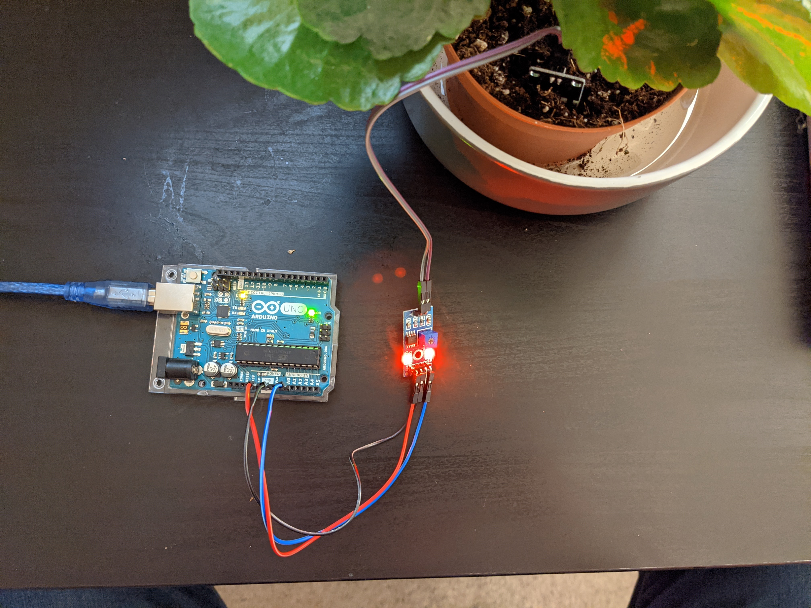

<h1 align="center">Plant Monitoring System</h1>

<h1 align="center">
  <br>
  <a href="https://master-plant.com">
  
</a>
</h1>

<p align="center">
  <a href="#about">About</a> •
  <a href="#installation">Installation</a> •
  <a href="#features">Features</a> •
  <a href="#license">License</a>
</p>

---

## About

<table>
<tr>
<td>

**Plant** monitoring system.


<p align="right">
<sub>(Preview)</sub>
</p>

</td>
</tr>
</table>

## Installation

##### Downloading and installing steps:

1. Clone the repo
```shell
git clone https://github.com/edjchapman/MasterPlant
```

## Features

- Go Server/API
- Arduino sensor system
- React Native iOS & Android apps

## License

[](https://tldrlegal.com/license/gnu-lesser-general-public-license-v3-(lgpl-3))

- Copyright © [Edward Chapman](https://edwardchapman.co.uk "Master Plant").
