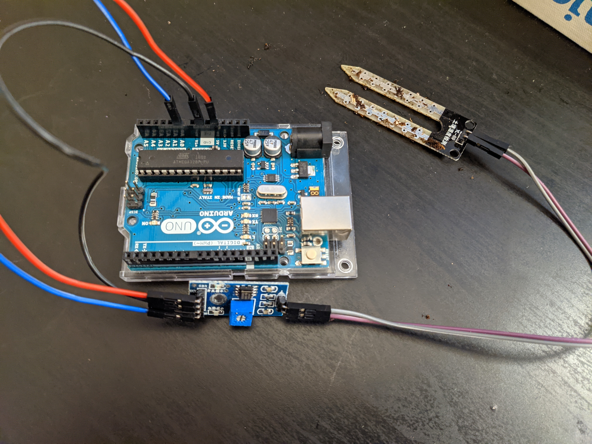

Arduino Configuration
=====================

## Soil Moisture Sensor

Two components
 1. Probe with two pads that detect water content.
 2. Electronic board

Pin Wiring

| Pin         | Wiring to Arduino | Colour |
| ----------- | ----------------- | ------ |
| A0          | Analogue Pin      | Blue   |
| GND         | GND               | Black  |
| VCC         | 5V                | Red    |
